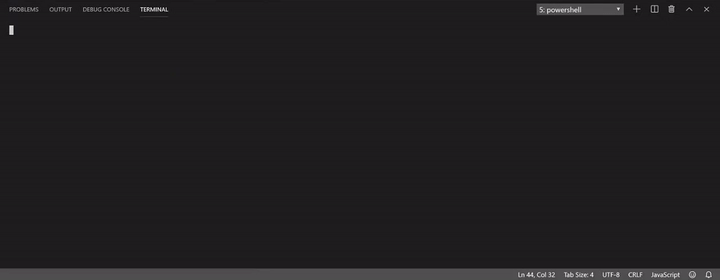

# bamazon

**What bamazon does:**

- bamazon is a command line node app that works kind of like Amazon. The user is prompted initially with a list of items from a MySql database and they are asked the id of the item they would like. They are then prompted to determine how many of the item they would like. If the item is in stock, the user is shown the total cost of their purchase. If the item is not in stock, they are told that there is not enough of the item and they are prompted the list of items available from the database again.

---

**How to use bamazon:**

- initialize bamazon:

> node bamazonCustomer.js

> (user will enter id of item)

> (user will enter how many they would like to purchase)

When the item is in stock, bamazon will work like this in terminal:

When the item is not in stock, bamazon will work like this in terminal:

*(item data coming from MySql database)*

---

**Link to deployed version of app:**

- https://mercedeswalsh.github.io/bamazon/

---

**Technologies used in bamazon:**

- Node.js

- JavaScript

- GitHub

- inquirer npm

- mysql2 npm

- MySql

---

**My role in app development**

- Developer of bamazon through Coding Bootcamp at UCI

---